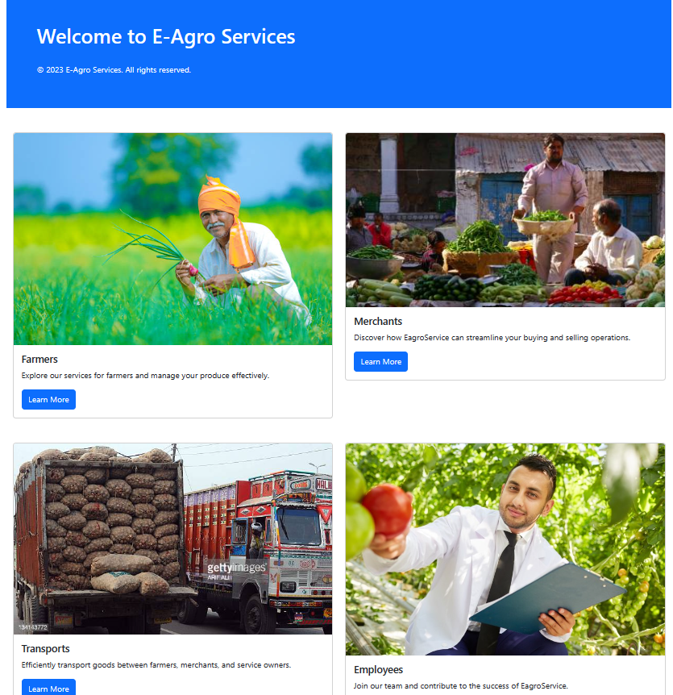

# Transflower E-Agro Services

It is a web-based application that helps agro service owners and vegetable traders maintain their business records. The application will provide functionalities to register farmers, collection managers, and transport agencies, manage collections, billing records, and generate graphical and tabular reports for the users.

## Requirements
- This system will be accessible for registered users and corporate agencies.
- This system will provide role-wise dashboard navigations.
- The users will be accessible for viewing their personal data and business data.
- Collection Manager can register with the collection center details.
- The owner of the collection Centre can log in as a collection manager.
- Dashboard will provide information using graphs, indicators, as well as grid data presentation.
- Only registered farmers can log into the system.
- Farmers can modify their profile.
- Registered farmers will be able to get a helpline contact number in case of emergency.
- Farmers can access their own details only.
- Farmers can see their history of collections carried out by the collection center.
- Farmers can see their payments against the collections paid by the merchant.
- Farmers can see their revenue for their particular item or year-wise collections.
- Only registered consignees can log into the system.
- Consignees can modify their profile.
- Registered consignees will be able to get a helpline contact number in case of emergency.
- Consignees can access their own details only.
- Consignees can see their revenue for their particular item or year-wise purchased items.
- Only registered transport agencies can log into the system.
- Transport agencies can modify their profile.
- Registered transport agencies will be able to get a helpline contact number in case of emergency.
- Transport agencies can access their own details only.
- Transport can see their revenue for their particular vehicle or year-wise history.

### System Behaviour
- Only Admin or owner of the E-Agro Services will see all records.
- Only Admin should be able to modify their own personal details.
- Farmer can log in with their user ID and password. Admin and farmers can access their details.
- No user can access other users' details except admin.
- System will provide access to the content, operations using Role-based security (Authorization) (Permissions based on Role).
- The system will back up user data regularly and recover it in a short time to keep the system operational.
- Continuous updates are maintained through email, and continuous administration is done to keep contact with users.
- During peak hours, the system will maintain the same user experience by managing load balancing.
- Uptime: 24*7 available, 99.999%
- A commercial database software will be used to maintain system data persistence.
- A web server will be installed to host online E-agro (Web Application) to manage server capabilities.
- IT operations team will easily monitor and configure the system using administrative tools provided by servers.
- Separate environments will be maintained for the system for isolation in production, testing, and development.
- The system will provide a portable User Interface (HTML, CSS, Angular) through which users will access the web application.
- The system can be deployed to a single server, multi-server, to any OS, Cloud (Azure or AWS or GCP).
- Only registered users will be able to log in after authentication.
- The system will maintain users' details.
- The system will implement backup and recovery for retaining users' data and their business data over time.
- The system will use cache for faster data retrieval and improved performance.
- During peak hours, the system will maintain the same user experience by managing load balancing.
- The system will be able to manage all transactions in isolation.
- The system will be designed and developed using reusable, independent or dependent business scenarios in the form of modules.
- These modules will be loosely coupled and highly cohesive.
- The system will contain CRM, Billing, membership, and Roles management modules.
- The system will provide a consistent user experience to users irrespective of load.
- The users' login page will be secure from malicious attacks and phishing.
- Separate environments will be maintained for the system for isolation in production, testing, and development.
